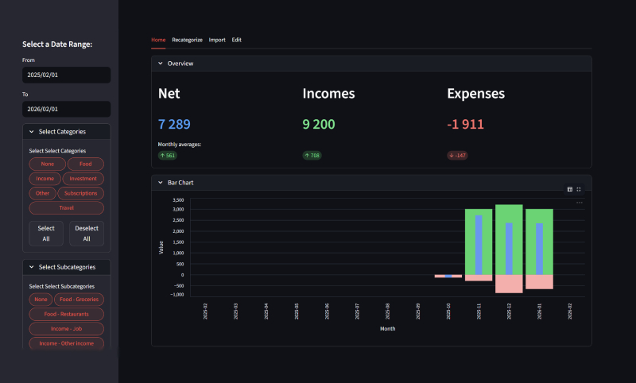

# CashmoneyDjango

A personal finance dashboard built with Django and Streamlit. Demo available [here](https://cashmoney.streamlit.app/).

<p align="center">
  
</p>

---

## Overview

CashmoneyDjango is a personal finance tracking tool that combines a **Django** backend with a **Streamlit** frontend. Import bank transactions from CSV files, categorize them with keywords, and visualize your spending through interactive charts and filters.

### Features

- **Interactive Dashboard** -- Bar charts, sunburst charts, and overview statistics powered by Plotly
- **Multi-Account Support** -- Track transactions across multiple bank accounts
- **Categorization** -- Organize transactions into categories, subcategories, and Want/Need/Investment types
- **Keyword-Based Auto-Categorization** -- Automatically assign categories based on transaction descriptions
- **CSV Import** -- Import transactions from bank CSV exports with configurable column mappings
- **Flexible Filtering** -- Filter by date, category, bank account, tags, and more
- **Tagging** -- Apply custom tags to transactions for additional grouping
- **Docker Support** -- Full Docker Compose setup with PostgreSQL

---

## Table of Contents

- [Getting Started](#getting-started)
  - [Prerequisites](#prerequisites)
  - [Local Setup](#local-setup)
  - [Docker Setup](#docker-setup)
- [Usage](#usage)
- [Project Structure](#project-structure)
- [Configuration](#configuration)

---

## Getting Started

### Prerequisites

- Python 3.12+
- Git
- Docker and Docker Compose (optional, for containerized setup)

### Local Setup

#### 1. Clone the repository

```bash
git clone https://github.com/boud96/CashmoneyDjango.git
cd CashmoneyDjango
```

#### 2. Create and activate a virtual environment

```bash
python -m venv .venv
```

| Windows                  | Linux / macOS                     |
|--------------------------|-----------------------------------|
| `.venv\Scripts\activate` | `source .venv/bin/activate`       |

#### 3. Install dependencies

```bash
pip install -r requirements.txt
```

#### 4. Configure environment variables

```bash
cp .env.example .env
```

Edit `.env` and set your values. For PostgreSQL, update the `DB_*` variables. For a quick local demo with SQLite, set `DEMO_MODE=True`.

#### 5. Run database migrations

```bash
python manage.py makemigrations
python manage.py migrate
```

#### 6. Start the application

You need to run both the Django backend and the Streamlit frontend:

```bash
# Terminal 1 - Django
python manage.py runserver

# Terminal 2 - Streamlit
streamlit run home.py
```

On Windows you can also use the included batch script:

```bash
run.bat
```

The services will be available at:

| Service   | URL                       |
|-----------|---------------------------|
| Django    | http://127.0.0.1:8000/    |
| Streamlit | http://localhost:8501/     |

### Docker Setup

#### Prerequisites

- [Docker](https://docs.docker.com/get-docker/)
- [Docker Compose](https://docs.docker.com/compose/install/)

#### Configuration

Create a `.env` file based on the template:

```bash
cp .env.example .env
```

Edit the `.env` file and set the appropriate values. When using Docker, `DB_HOST` should be set to `db` (the service name in `docker-compose.yml`).

#### Start all services

```bash
docker compose up -d
```

This will start:

- **PostgreSQL** database on port 5432
- **Django** application on port 8000
- **Streamlit** frontend on port 8501

#### View logs

```bash
# All services
docker compose logs -f

# Individual services
docker compose logs -f django
docker compose logs -f streamlit
docker compose logs -f db
```

#### Stop all services

```bash
docker compose down
```

#### Rebuild containers after changes

```bash
docker compose up -d --build
```

#### Accessing the application

| Service          | URL                            |
|------------------|--------------------------------|
| Django Admin     | http://localhost:8000/admin/    |
| Streamlit        | http://localhost:8501/          |

#### Database management

Create a superuser:

```bash
docker compose exec django python manage.py createsuperuser
```

Run migrations:

```bash
docker compose exec django python manage.py makemigrations
docker compose exec django python manage.py migrate
```

Back up the database:

```bash
docker compose exec db pg_dump -U <db_user> <db_name> > backup.sql
```

#### Troubleshooting

Check container status:

```bash
docker compose ps
```

Access a container shell:

```bash
docker compose exec django /bin/bash
docker compose exec streamlit /bin/bash
docker compose exec db /bin/bash
```

---

## Usage

1. **Import Transactions** -- Go to the Import tab and upload a CSV export from your bank.
2. **Set Up Categories** -- Use the Edit tab to create categories, subcategories, and keyword rules.
3. **Recategorize** -- Apply keyword rules to automatically categorize transactions via the Recategorize tab.
4. **Explore** -- Use the sidebar filters and the Home tab to analyze your spending with charts and tables.

---

## Project Structure

```
CashmoneyDjango/
├── core/                   # Django project configuration and backend
│   ├── base/               # Main Django app (models, migrations, admin)
│   │   ├── management/     # Custom management commands
│   │   ├── migrations/     # Database migrations
│   │   ├── utils/          # Utility modules
│   │   ├── models.py       # Data models (Transaction, Category, etc.)
│   │   └── admin.py        # Django admin configuration
│   ├── settings.py         # Django settings
│   ├── urls.py             # URL routing
│   └── services.py         # Backend service layer
├── widgets/                # Streamlit UI components
│   ├── filters/            # Sidebar filter widgets (date, category, tags, etc.)
│   ├── stats/              # Chart and statistics widgets
│   ├── csv_import.py       # CSV import widget
│   ├── edit.py             # CRUD widgets for categories, keywords, etc.
│   └── recategorize.py     # Recategorization widget
├── pages/                  # Additional Streamlit pages
├── static/                 # Static assets
├── home.py                 # Streamlit app entry point
├── app.py                  # Django-Streamlit integration
├── constants.py            # Application constants
├── manage.py               # Django management CLI
├── requirements.txt        # Python dependencies
├── Dockerfile              # Container image definition
├── docker-compose.yml      # Multi-container orchestration
├── entrypoint.sh           # Docker entrypoint script
└── run.bat                 # Windows quick-start script
```

---

## Configuration

All configuration is managed through environment variables in the `.env` file. See [.env.example](.env.example) for all available options.

Key variables:

| Variable                 | Description                              | Default                              |
|--------------------------|------------------------------------------|--------------------------------------|
| `SECRET_KEY`             | Django secret key                        | (required)                           |
| `DEBUG`                  | Enable Django debug mode                 | `True`                               |
| `DEMO_MODE`              | Run in read-only demo mode with SQLite   | `False`                              |
| `DB_ENGINE`              | Database backend                         | `django.db.backends.postgresql`      |
| `DB_NAME`                | Database name                            | `cashmoney`                          |
| `DB_USER`                | Database user                            | `postgres`                           |
| `DB_PASSWORD`            | Database password                        | `admin`                              |
| `DB_HOST`                | Database host (`db` when using Docker)   | `db`                                 |
| `DB_PORT`                | Database internal port                   | `5432`                               |
| `DB_EXTERNAL_PORT`       | Database external port (local access)    | `5433`                               |
| `STREAMLIT_PORT`         | Streamlit server port                    | `8501`                               |
| `DJANGO_PORT`            | Django server port                       | `8000`                               |
