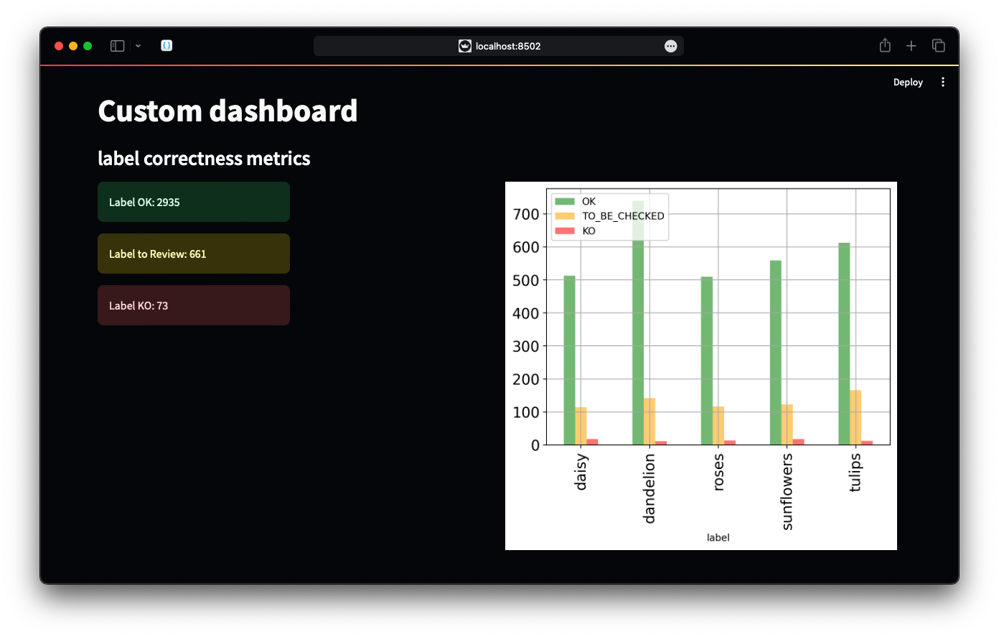

<h2 align="center">Django Streamlit</h2>
<h4 align="center">Show a streamlit project within django</h4>
<h2 align="center">

</h2>

<h1 align="center" >
    
</h1>

This project demonstrate how to use a streamlit dashboard within a django environment.

## Table of Contents

- [Getting Started](#getting-started)
    - [Prerequisites](#prerequisites)
    - [Installation](#installation)
- [Preparing Data](#preparing-data)
- [Running](#running)
- [Insights](#insights)

## Getting Started

The next command will start the dashboard in a local/network URL independent of the django URL.

```bash
streamlit run st_annotations_monitoring.py
```

### Prerequisites

#### 1. Clone the Project

Execute the next command on your terminal

```bash
git clone https://github.com/Alfareiza/streamlitdjango.git
```

#### 2. Isolate the environment

Once the repository has been cloned, a folder is created with the name of the project `streamlitdjango`.

Go toward this folder using the terminal :

```bash
cd streamlitdjango
```

Make sure you have python installed and execute:

```bash
python -m venv .venv
```

Then to activate the isolated environment execute the next command according to your OS

| Windows                |           Linux           |
|------------------------|:-------------------------:|
| .venv\Scripts\activate | source .venv/bin/activate |

### Installation

All the dependencies and sub-dependencies will be installed on the local project.

```bash
pip install -r requirements.txt
```

## Preparing Data

In order to prepare the data is required to execute the migrations and load the data from the `outuput.json` file.

### Migrations

```commandline
python manage.py makemigrations
```

```commandline
python manage.py migrate
```

### Loading Data

```commandline
python manage.py loaddata output.json
```

## Running

To execute the streamlit dashboard, the next command will start the dashboard in a local/network URL independent of the
django URL

```bash
streamlit run st_annotations_monitoring.py
```

To execute the django project, execute the next command

```bash
python manage.py runserver
```

## Insights

- Once a query is created, Streamlit is allowed to receive it as a dataframe (from pandas)
- Streamlit and django runs in differents ports
- I did not find a way to execute Streamlit within a django url
